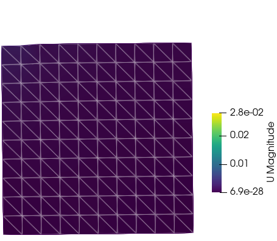
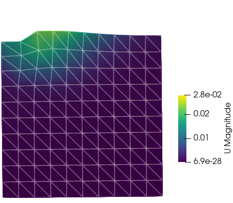
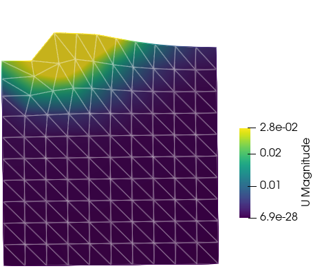
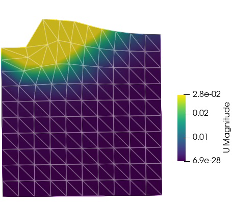
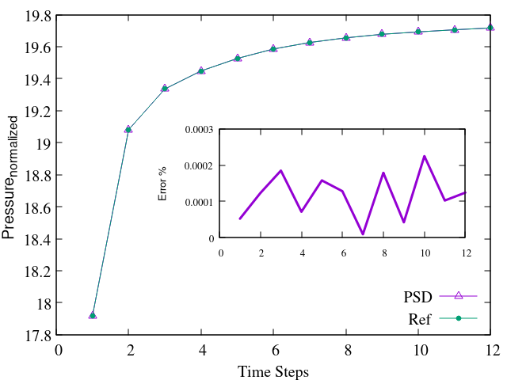

## Tutorial 1
### 2D elasto-plastic problem
#### Nonlinear elasto-plastic Von-Mises material analysis via MFront $-$Isotropic linear hardening plasticity$-$ 

> 💡 **Note**: This document details a tutorial that allows one to use the `PSD-MFront` interface for nonlinear elasto-plastic problems. `MFront` handles material‑behaviour updates and non‑linearities. It is advised to follow this tutorial after tutorials 1 and 9 on linear elasticity.

> 💡 **Note**: This tutorial serves as an introduction to nonlinear `PSD-MFront` coupling. The real strength lies in applying MFront to more complex material behaviors.

### Introduction

This tutorial addresses the incremental analysis of a nonlinear elasto-plastic Von‑Mises material in 2D ($x$‑$y$). The domain of interest is a quarter‑cylinder with external radius $R_e$ and internal radius $R_i$.

Symmetry conditions are applied at the bottom ($y=0$) and left ($x=0$) boundaries. A uniform internal pressure $q$ is applied at the internal boundary. This pressure increases from 0 to

$$
q_{\text{lim}} = \frac{2}{\sqrt3} \sigma_0 \,\ln\!\left(\frac{R_e}{R_i}\right)
$$

which is the analytical collapse load for a perfectly plastic material (no hardening).

<figure style="text-align: center;">
  
  <figcaption><em>Figure: Domain of the non-linear problem.</em></figcaption>
</figure>

The material follows an isotropic elasto-plastic Von‑Mises yield condition with strength $\sigma_0$ and hardening modulus $H$:

$$
f(\sigma) = \sqrt{\tfrac{3}{2} s:s} - \sigma_0 - H p \le 0
$$

where $p$ is the equivalent plastic strain and $s = \operatorname{dev}\sigma_{\text{elas}}$. The tangent modulus is

$$
E_t = \frac{E H}{E + H}
$$

An iterative predictor–corrector return‑mapping algorithm within a Newton‑Raphson loop is used. Thanks to linear isotropic hardening, the return mapping is analytical.

The displacement-field evolution is shown below:

<figure style="text-align: center;">
  <!-- First row -->
  
  
  
   
  <!-- Second row -->
  
  
  
  <figcaption><em>Figure: Warped displacement field evolution — from top left \(t_0, t_4, t_8, t_{12}, t_{16}, t_{19}\).</em></figcaption>
</figure>

The return mapping solves for $\sigma_{n+1}$ and $p_{n+1}$ from $\sigma_n$, $p_n$, and $\Delta\varepsilon$, handled by MFront along with the algorithmic tangent.

1. Compute trial stress:

    $$
    \sigma_{\text{elas}} = \sigma_n + \mathbf{M} \Delta\varepsilon
    $$

2. Check plasticity criterion:

    $$
    f_{\text{elas}} = \sigma_{\text{elas}}^{\rm eq} - \sigma_0 - H\,p_n
    $$

3. If $f_{\text{elas}} \le 0$, the step is elastic ($\Delta p = 0$). Otherwise:

    $$
    \Delta p = \frac{f_{\text{elas}}}{3\mu + H}
    $$

4. Correct stress:

    $$
    \sigma_{n+1} = \sigma_{\text{elas}} - \beta s,\quad \beta = \frac{3\mu}{\sigma_{\text{elas}}^{\rm eq}} \Delta p
    $$

### Procedure to simulate in PSD

### Step 1: Preprocessing

Start by using `PSD_PreProcess` to set up physics, boundary conditions, and activate MFront:

<pre><code>
PSD_PreProcess -problem elasto_plastic -model von_mises -dimension 2 \
-tractionconditions 1 -dirichletconditions 2 -postprocess u -useMfront
</code></pre>

This generates `.edp` files in your directory.

> 💡 **Note**: Argument meanings:
>
> * `-problem elasto_plastic`: elasto‑plastic simulation
> * `-model von_mises`: Von‑Mises yield condition
> * `-dimension 2`: 2D
> * `-tractionconditions 1`: pressure BC
> * `-dirichletconditions 2`: two Dirichlet BCs
> * `-postprocess u`: output for ParaView
> * `-useMfront`: enable MFront interface

Set material and geometric parameters in `ControlParameters.edp`:

<pre><code>// Material parameters
real E     = 70.e3, nu = 0.3, sig0 = 250., Et = E/100., H = E*Et/(E-Et);
real Re    = 1.3,     Ri = 1.0;
real Qlim  = 2./sqrt(3.)*log(Re/Ri)*sig0;
</code></pre>

Define MFront behavior:

<pre><code>string MaterialBehaviour  = "IsotropicLinearHardeningPlasticity";
string MaterialHypothesis = "PLANESTRAIN";
string PropertyNames      = "YoungModulus PoissonRatio HardeningSlope YieldStrength";
real[int] PropertyValues  = [ E, nu, H, sig0 ];
</code></pre>

Set algorithmic parameters:

<pre><code>// Algorithmic parameters
macro EpsNrCon  () 1.e-8
macro NrMaxItr  () 200
macro TlMaxItr  () 20
</code></pre>

Define Dirichlet BCs:

<pre><code>
// Dirichlet boundary conditions
macro Dbc0On 1
macro Dbc0Uy 0.
macro Dbc1On 3
macro Dbc1Ux 0.
</code></pre>

Define traction (Neumann) BCs:

<pre><code>
// Traction boundary conditions
real tl;
macro Tbc0On  4
macro Tbc0Tx  Qlim*tl*N.x
macro Tbc0Ty  Qlim*tl*N.y
</code></pre>

Here, `tl` is a timestep loading parameter.

### Step 2: Solving

Use multiple cores to solve:

<pre><code>
PSD_Solve -np 4 Main.edp -mesh ./../Meshes/2D/quater_cylinder.msh -v 0
</code></pre>

* `-np 4`: use 4 MPI processes
* `-mesh …`: specify mesh file
* `-v 0`: verbosity level

Larger problems can use more cores—PSD supports up to thousands of MPI processes.

### Step 3: Postprocessing

After solving, use ParaView on the `.pvd` files in the `VTUs…` directory. Visualize displacement fields like those shown in:

<figure style="text-align: center;">

  

    
    
  

  

    
    
  

  

    
    
  

  <figcaption style="max-width: 800px; margin: 0 auto; font-style: italic;">
    Figure: Validation results comparison of PSD (left column) and reference code (right column) at different timesteps (<em>t0, t10, t19</em>). Reference results used for comparison were obtained by installing and running the FEniCS Solid Mechanics library [Garth N. Wells (2021)].
  </figcaption>
</figure>

You’re now done with your 2D elasto-plastic simulation using the MFront interface!

### Validation

Comparison is made to FEniCS Solid Mechanics results \[@Fenics]. Displacement analysis matches within good accuracy.

<figure style="text-align: center;">
  
  <figcaption style="max-width: 600px; margin: 0 auto; font-style: italic;">
    Figure: Validation of the displacement movement of inner border obtained by PSD and another reference code. Reference results used for comparison were obtained by installing and running the FEniCS solid mechanics codes —
    <a href="https://bitbucket.org/fenics-apps/fenics-solid-mechanics" target="_blank" rel="noopener noreferrer">https://bitbucket.org/fenics-apps/fenics-solid-mechanics</a>.
  </figcaption>
</figure>

<figure style="text-align: center;">
  
  

  <figcaption style="max-width: 700px; margin: 0 auto; font-style: italic;">
    Figure: Validation of the displacement field obtained by PSD and another reference code. The displacement magnitude is plotted on the central line which bisects the geometry into two. On the left, time steps — <em>t0, t4, t8, t12, t16</em> — are plotted and on the right — <em>t19</em>. Reference results used for comparison were obtained by installing and running the FEniCS Solid Mechanics library [Garth N. Wells (2021)].
  </figcaption>
</figure>

The results confirm PSD‑MFront validity for Von‑Mises plasticity.

---

## Tutorial 2
### Native 2D elasto-plastic problem (without MFront)
#### Nonlinear Von-Mises material analysis $-$ isotropic linear hardening

> 💡 **Note**: This tutorial uses PSD's native small-strain J2 radial-return implementation with linear isotropic hardening and a consistent tangent. It does not require MFront.

> 💡 **Note**: For the MFront implementation of the same problem, follow Tutorial 1 above.

### Introduction

This tutorial addresses the incremental analysis of a nonlinear elasto-plastic Von‑Mises material in 2D ($x$‑$y$). The domain of interest is a quarter‑cylinder with external radius $R_e$ and internal radius $R_i$.

Symmetry conditions are applied at the bottom ($y=0$) and left ($x=0$) boundaries. A uniform internal pressure $q$ is applied at the internal boundary. This pressure increases from 0 to

$$
q_{\text{lim}} = \frac{2}{\sqrt3} \sigma_0 \,\ln\!\left(\frac{R_e}{R_i}\right)
$$

which is the analytical collapse load for a perfectly plastic material (no hardening).

<figure style="text-align: center;">
  
  <figcaption><em>Figure: Domain of the non-linear problem.</em></figcaption>
</figure>

The material follows an isotropic elasto-plastic Von‑Mises yield condition with strength $\sigma_0$ and hardening modulus $H$:

$$
f(\sigma) = \sqrt{\tfrac{3}{2} s:s} - \sigma_0 - H p \le 0
$$

where $p$ is the equivalent plastic strain and $s = \operatorname{dev}\sigma_{\text{elas}}$. The tangent modulus is

$$
E_t = \frac{E H}{E + H}
$$

An iterative predictor–corrector return‑mapping algorithm within a Newton‑Raphson loop is used. Thanks to linear isotropic hardening, the return mapping is analytical.

The displacement-field evolution is shown below:

<figure style="text-align: center;">
  <!-- First row -->
  
  
  
   
  <!-- Second row -->
  
  
  
  <figcaption><em>Figure: Warped displacement field evolution — from top left \(t_0, t_4, t_8, t_{12}, t_{16}, t_{19}\).</em></figcaption>
</figure>

The return mapping solves for $\sigma_{n+1}$ and $p_{n+1}$ from $\sigma_n$, $p_n$, and $\Delta\varepsilon$. PSD evaluates the radial return and its consistent algorithmic tangent at quadrature points.

1. Compute trial stress:

    $$
    \sigma_{\text{elas}} = \sigma_n + \mathbf{M} \Delta\varepsilon
    $$

2. Check plasticity criterion:

    $$
    f_{\text{elas}} = \sigma_{\text{elas}}^{\rm eq} - \sigma_0 - H\,p_n
    $$

3. If $f_{\text{elas}} \le 0$, the step is elastic ($\Delta p = 0$). Otherwise:

    $$
    \Delta p = \frac{f_{\text{elas}}}{3\mu + H}
    $$

4. Correct stress:

    $$
    \sigma_{n+1} = \sigma_{\text{elas}} - \beta s,\quad \beta = \frac{3\mu}{\sigma_{\text{elas}}^{\rm eq}} \Delta p
    $$

### Procedure to simulate in PSD

### Step 1: Preprocessing

Use `PSD_PreProcess` without `-useMfront` to select the native implementation:

<pre><code>
PSD_PreProcess -problem elasto_plastic -model von_mises -dimension 2 \
-tractionconditions 1 -dirichletconditions 2 -postprocess u
</code></pre>

This generates `.edp` files in your directory.

> 💡 **Note**: Argument meanings:
>
> * `-problem elasto_plastic`: elasto‑plastic simulation
> * `-model von_mises`: Von‑Mises yield condition
> * `-dimension 2`: 2D
> * `-tractionconditions 1`: pressure BC
> * `-dirichletconditions 2`: two Dirichlet BCs
> * `-postprocess u`: output for ParaView
>
> The absence of `-useMfront` selects PSD's native implementation.

Set material and geometric parameters in `ControlParameters.edp`:

<pre><code>// Material parameters
real E     = 70.e3, nu = 0.3, sig0 = 250., Et = E/100., H = E*Et/(E-Et);
real Re    = 1.3,     Ri = 1.0;
real Qlim  = 2./sqrt(3.)*log(Re/Ri)*sig0;
</code></pre>

No MFront behaviour, hypothesis, property-name vector, or external material library is needed; PSD uses the material constants above directly.

Set algorithmic parameters:

<pre><code>// Algorithmic parameters
macro EpsNrCon  () 1.e-8
macro NrMaxItr  () 200
macro TlMaxItr  () 20
</code></pre>

Define Dirichlet BCs:

<pre><code>
// Dirichlet boundary conditions
macro Dbc0On 1
macro Dbc0Uy 0.
macro Dbc1On 3
macro Dbc1Ux 0.
</code></pre>

Define traction (Neumann) BCs:

<pre><code>
// Traction boundary conditions
real tl = 0.;
macro Tbc0On  4
macro Tbc0Tx  Qlim*tl*N.x
macro Tbc0Ty  Qlim*tl*N.y
</code></pre>

Here, `tl` is a timestep loading parameter.

### Step 2: Solving

Use multiple cores to solve:

<pre><code>
PSD_Solve -np 4 Main.edp -mesh ./../Meshes/2D/quater_cylinder.msh -v 0
</code></pre>

* `-np 4`: use 4 MPI processes
* `-mesh …`: specify mesh file
* `-v 0`: verbosity level

Larger problems can use more cores—PSD supports up to thousands of MPI processes.

### Step 3: Postprocessing

After solving, use ParaView on the `.pvd` files in the `VTUs…` directory. Visualize displacement fields like those shown in:

<figure style="text-align: center;">

  

    
    
  

  

    
    
  

  

    
    
  

  <figcaption style="max-width: 800px; margin: 0 auto; font-style: italic;">
    Figure: Validation results comparison of PSD (left column) and reference code (right column) at different timesteps (<em>t0, t10, t19</em>). Reference results used for comparison were obtained by installing and running the FEniCS Solid Mechanics library [Garth N. Wells (2021)].
  </figcaption>
</figure>

You’re now done with a native 2D plane-strain elasto-plastic simulation. The native implementation currently supports parallel 2D `von_mises`. For the MFront backend or a 3D problem, use the MFront workflow described in Tutorial 1 above.

### Validation

Comparison is made to FEniCS Solid Mechanics results \[@Fenics]. Displacement analysis matches within good accuracy.

<figure style="text-align: center;">
  
  <figcaption style="max-width: 600px; margin: 0 auto; font-style: italic;">
    Figure: Validation of the displacement movement of inner border obtained by PSD and another reference code. Reference results used for comparison were obtained by installing and running the FEniCS solid mechanics codes —
    <a href="https://bitbucket.org/fenics-apps/fenics-solid-mechanics" target="_blank" rel="noopener noreferrer">https://bitbucket.org/fenics-apps/fenics-solid-mechanics</a>.
  </figcaption>
</figure>

<figure style="text-align: center;">
  
  

  <figcaption style="max-width: 700px; margin: 0 auto; font-style: italic;">
    Figure: Validation of the displacement field obtained by PSD and another reference code. The displacement magnitude is plotted on the central line which bisects the geometry into two. On the left, time steps — <em>t0, t4, t8, t12, t16</em> — are plotted and on the right — <em>t19</em>. Reference results used for comparison were obtained by installing and running the FEniCS Solid Mechanics library [Garth N. Wells (2021)].
  </figcaption>
</figure>

The results validate PSD's native Von-Mises plasticity implementation against the reference solution.

---

## Tutorial 3
### Native Drucker–Prager strip-footing problem (without MFront)
#### Associated perfect plasticity in two-dimensional plane strain

> 💡 **Note**: This tutorial uses PSD's native Drucker–Prager implementation. Do not add `-useMfront`: this model performs its return mapping and consistent tangent update directly in PSD.

> 💡 **Scope**: The current implementation is small-strain, plane-strain, associated, perfectly plastic Drucker–Prager. It has no hardening, tension cut-off, dilatancy angle distinct from the friction angle, or three-dimensional implementation.

### Introduction

This tutorial studies a displacement-controlled strip footing. Symmetry about the footing centreline permits the right half of the physical problem to be represented by the square domain

$$
\Omega=[0,10]\times[0,10].
$$

The represented half-width of the footing is $B=1$. A downward settlement $\bar u$ is imposed on the top segment $0\le x\le B$, while the rest of the top surface is traction-free. The bottom is restrained vertically and both vertical sides are restrained horizontally. These lateral conditions reproduce the
reference benchmark of Čermák, Sysala, and Valdman.

The Gmsh physical labels are:

| Label | Boundary | Condition |
|:---:|---|---|
| 1 | bottom | $u_y=0$ |
| 2 | right side | $u_x=0$ |
| 3 | footing | $u_y=-\bar u$ |
| 4 | free top | zero traction |
| 5 | left symmetry | $u_x=0$ |
| 6 | surface | material domain |

The mesh file used for this tutorial is `strip_footing_geomechanics.msh`.

### Drucker–Prager theory

#### Kinematics and elasticity

Small strain is additively decomposed into elastic and plastic parts:

$$
\boldsymbol\varepsilon
=\boldsymbol\varepsilon^e+\boldsymbol\varepsilon^p,
\qquad
\boldsymbol\sigma
=2\mu\,\operatorname{dev}(\boldsymbol\varepsilon^e)
+K\operatorname{tr}(\boldsymbol\varepsilon^e)\boldsymbol I,
$$

where

$$
\mu=\frac{E}{2(1+\nu)},
\qquad
K=\frac{E}{3(1-2\nu)}.
$$

Plane strain means $\varepsilon_{zz}=0$, but $\sigma_{zz}$ and $\varepsilon^p_{zz}$ are generally non-zero and must be retained by the constitutive update. PSD stores symmetric tensors in Kelvin/Mandel ordering,
$$
[xx,yy,zz,\sqrt{2}xy],
$$

so a tensor inner product is an ordinary vector dot product.

#### Yield surface and associated flow

PSD uses a tension-positive convention and the yield function

$$
f(\boldsymbol\sigma)
=\sqrt{J_2}+\eta p-c\le0,
\qquad
p=\frac{1}{3}\operatorname{tr}(\boldsymbol\sigma),
\qquad
\sqrt{J_2}=\frac{\|\operatorname{dev}\boldsymbol\sigma\|}{\sqrt2}.
$$

For the plane-strain parameter mapping used by the reference implementation, the friction angle $\phi$ and physical cohesion $c_0$ are converted to

$$
\eta=\frac{3\tan\phi}{\sqrt{9+12\tan^2\phi}},
\qquad
c=\frac{3c_0}{\sqrt{9+12\tan^2\phi}}.
$$

The flow is associated:

$$
\dot{\boldsymbol\varepsilon}^{p}
=\dot\lambda\,\frac{\partial f}{\partial\boldsymbol\sigma},
\qquad \dot\lambda\ge0.
$$

Consequently the friction parameter also controls plastic volumetric strain. Do not substitute another inscribed or circumscribed Drucker–Prager mapping without regenerating the reference curve.

#### Elastic predictor and return classification

At Newton iterate $k$, using the plastic strain from the last converged load step, PSD forms

$$
\boldsymbol\varepsilon^{e,\mathrm{tr}}
=\boldsymbol\varepsilon(\boldsymbol u^k)-\boldsymbol\varepsilon^p_n,
$$

$$
p^{\mathrm{tr}}=K\operatorname{tr}(\boldsymbol\varepsilon^{e,\mathrm{tr}}),
\qquad
\rho^{\mathrm{tr}}
=2\mu\|\operatorname{dev}(\boldsymbol\varepsilon^{e,\mathrm{tr}})\|.
$$

Two scalar criteria distinguish all three branches:

$$
C_1=\frac{\rho^{\mathrm{tr}}}{\sqrt2}
     +\eta p^{\mathrm{tr}}-c,
$$

$$
C_2=\eta p^{\mathrm{tr}}
     -K\eta^2\frac{\rho^{\mathrm{tr}}}{\mu\sqrt2}-c.
$$

The response is:

| Conditions | Return branch |
|---|---|
| $C_1\le0$ | elastic |
| $C_1>0$ and $C_2\le0$ | smooth part of the cone |
| $C_1>0$ and $C_2>0$ | cone apex |

For a smooth return,

$$
\Delta\lambda_s=\frac{C_1}{\mu+K\eta^2},
\qquad
\widehat{\boldsymbol N}
=\frac{\operatorname{dev}(\boldsymbol\varepsilon^{e,\mathrm{tr}})}
       {\|\operatorname{dev}(\boldsymbol\varepsilon^{e,\mathrm{tr}})\|},
$$

$$
\widehat{\boldsymbol M}
=\sqrt2\mu\widehat{\boldsymbol N}+K\eta\boldsymbol I,
\qquad
\boldsymbol\sigma_{n+1}
=\boldsymbol\sigma^{\mathrm{tr}}
-\Delta\lambda_s\widehat{\boldsymbol M},
$$

$$
\boldsymbol\varepsilon^p_{n+1}
=\boldsymbol\varepsilon^p_n
+\Delta\lambda_s
\left(\frac{\widehat{\boldsymbol N}}{\sqrt2}
      +\frac{\eta}{3}\boldsymbol I\right).
$$

At the apex, the deviatoric stress vanishes:

$$
\boldsymbol\sigma_{n+1}=\frac{c}{\eta}\boldsymbol I,
\qquad
\boldsymbol\varepsilon^p_{n+1}
=\boldsymbol\varepsilon_{n+1}
-\frac{c}{3K\eta}\boldsymbol I.
$$

#### Consistent tangent

Let $\mathbb P_{\mathrm{dev}}$ be the deviatoric projector and

$$
\mathbb C^e=2\mu\mathbb P_{\mathrm{dev}}
            +K\boldsymbol I\otimes\boldsymbol I.
$$

On the smooth cone, PSD uses the exact consistent tangent

$$
\mathbb C^{\mathrm{alg}}
=\mathbb C^e
-\frac{2\sqrt2\mu^2\Delta\lambda_s}{\rho^{\mathrm{tr}}}
 \left(\mathbb P_{\mathrm{dev}}
       -\widehat{\boldsymbol N}\otimes\widehat{\boldsymbol N}\right)
-\frac{\widehat{\boldsymbol M}\otimes\widehat{\boldsymbol M}}
       {\mu+K\eta^2}.
$$

The tangent is elastic on elastic points and zero at apex points. The measured relative error is $2.556\times10^{-11}$.

### Finite-element and Newton discretization

The benchmark uses continuous P2 displacement on 200 triangular cells and the seven-point `FEQF5` triangle rule for stress, plastic strain, branch indicators, and tangent components. Although the Gmsh geometry itself uses three-node triangles, `-lagrange 2` makes the displacement approximation quadratic by adding mid-edge degrees of freedom.

The equilibrium residual is

$$
R(\boldsymbol u;\boldsymbol v)
=\int_\Omega
 \boldsymbol\sigma(\boldsymbol\varepsilon(\boldsymbol u)):
 \boldsymbol\varepsilon(\boldsymbol v)\,\mathrm d\Omega,
$$

and each semismooth Newton correction solves

$$
\int_\Omega
 \boldsymbol\varepsilon(\delta\boldsymbol u):
 \mathbb C^{\mathrm{alg}}:
 \boldsymbol\varepsilon(\boldsymbol v)\,\mathrm d\Omega
=-R(\boldsymbol u;\boldsymbol v).
$$

The native solver is organized as follows:

<pre><code>//==============================================================================
//  ------- Native Drucker-Prager algorithm -------
//------------------------------------------------------------------------------
//  Loop 1 : TlMaxItr;             # prescribed-settlement loop
//    update_settlement();
//    initialize_increment();      # Du = 0
//    restore_converged_state();   # stress and plastic strain
//    initialize_elastic_tangent();
//    assemble_linear_system();
//    Loop 2 : NrMaxItr;           # semismooth Newton loop
//      solve_linear_system();
//      update_increment();        # Du += du
//      compute_total_strain();
//      compute_elastic_trial_state();
//      classify_elastic_smooth_or_apex_return();
//      update_stress_and_plastic_strain();
//      update_consistent_tangent();
//      assemble_linear_system();
//      exit_if_converged();
//    commit_displacement_and_plastic_strain();
//    calculate_footing_reaction();
//==============================================================================
</code></pre>

### Procedure to simulate in PSD

### Step 1: Preprocessing

From a clean working directory, generate the native PSD problem with:

<pre><code>
PSD_PreProcess -problem elasto_plastic -model drucker_prager -dimension 2 \
  -dirichletconditions 4 -lagrange 2 -postprocess u
</code></pre>

The options mean:

* `-problem elasto_plastic`: select incremental elasto-plastic equilibrium;
* `-model drucker_prager`: select the native Drucker–Prager update;
* `-dimension 2`: select plane strain;
* `-dirichletconditions 4`: generate the four constrained boundary groups;
* `-lagrange 2`: use P2 displacement;
* `-postprocess u`: write the displacement time series for ParaView.

There is no `-tractionconditions` argument because the footing is loaded by a prescribed displacement. There is also no `-useMfront` argument.

The generated `ControlParameters.edp` contains:

<pre><code>// Physical inputs
real E             = 1.e7,
     nu            = 0.48,
     cohesion      = 450.,
     frictionAngle = 20.*pi/180.;
// Elastic constants and the benchmark's Drucker-Prager mapping
real lambda = E*nu/((1.+nu)*(1.-2.*nu)),
     mu     = E/(2.*(1.+nu)),
     bulk   = E/(3.*(1.-2.*nu)),
     dpEta  = 3.*tan(frictionAngle)
              /sqrt(9.+12.*tan(frictionAngle)^2),
     dpC    = 3.*cohesion/sqrt(9.+12.*tan(frictionAngle)^2);

real footingWidth = 1.,
     maxSettlement = 0.03;

// Twelve equal settlement increments and seven-point triangle quadrature
macro EpsNrCon  () 1.e-8
macro NrMaxItr  () 200
macro TlMaxItr  () 12
macro QFElastoPlastic FEQF5
</code></pre>

The four Dirichlet groups are also generated automatically:

<pre><code>// Label 1: bottom vertical restraint
macro Dbc0On 1
macro Dbc0Uy 0.

// Label 2: right horizontal restraint
macro Dbc1On 2
macro Dbc1Ux 0.

// Label 5: left symmetry
macro Dbc2On 5
macro Dbc2Ux 0.

// Label 3: displacement-controlled footing
macro Dbc3On 3
macro Dbc3Uy -tl*maxSettlement
</code></pre>

The model-specific finite-element spaces in `MeshAndFeSpace.edp` are:

<pre><code>// Pk is [P2,P2] because preprocessing used -lagrange 2
fespace Vh(Th, Pk);

// Constitutive variables live at the seven FEQF5 integration points
fespace Qh(Th, [QFElastoPlastic, QFElastoPlastic, QFElastoPlastic,
                QFElastoPlastic, QFElastoPlastic, QFElastoPlastic]);
fespace Ph(Th, QFElastoPlastic);
fespace Sh(Th, [QFElastoPlastic, QFElastoPlastic, QFElastoPlastic]);
</code></pre>

The generated return classification closely follows the equations above:

<pre><code>real denominatorApex   = bulk*dpEta^2;
real denominatorSmooth = mu + denominatorApex;

criterion1 = rhoTrial/SQ2 + dpEta*pressureTrial - dpC;
criterion2 = dpEta*pressureTrial
             - denominatorApex*rhoTrial/(mu*SQ2) - dpC;

plasticSwitch = (criterion1 > 0. ? 1. : 0.);
apexSwitch    = plasticSwitch*(criterion2 > 0. ? 1. : 0.);
smoothSwitch  = plasticSwitch - apexSwitch;

lambdaSmooth = smoothSwitch*criterion1/denominatorSmooth;
lambdaApex   = apexSwitch*(dpEta*pressureTrial-dpC)/denominatorApex;
</code></pre>

The stress correction and plastic-history candidate are evaluated pointwise in
the same quadrature spaces. `SQ2` is $\sqrt2$, and the `12` component is the
Mandel shear component $\sqrt2\sigma_{xy}$:

<pre><code>// Unit trial-deviator direction, active only on the smooth branch
[Normal11,Normal22,Normal12] =
  [smoothSwitch*DevElastic11/(normElastic+1.e-30),
   smoothSwitch*DevElastic22/(normElastic+1.e-30),
   smoothSwitch*DevElastic12/(normElastic+1.e-30)];
Normal33 = smoothSwitch*DevElastic33/(normElastic+1.e-30);

// Gradient direction used by the smooth stress correction
[Correction11,Correction22,Correction12] =
  [SQ2*mu*Normal11 + smoothSwitch*bulk*dpEta,
   SQ2*mu*Normal22 + smoothSwitch*bulk*dpEta,
   SQ2*mu*Normal12];
Correction33 = SQ2*mu*Normal33 + smoothSwitch*bulk*dpEta;

// Elastic/smooth response plus the hydrostatic apex replacement
[Sig11,Sig22,Sig12] =
  [(1.-apexSwitch)*SigTrial11-lambdaSmooth*Correction11
     +apexSwitch*dpC/dpEta,
   (1.-apexSwitch)*SigTrial22-lambdaSmooth*Correction22
     +apexSwitch*dpC/dpEta,
   (1.-apexSwitch)*SigTrial12-lambdaSmooth*Correction12];
Sig33 = (1.-apexSwitch)*SigTrial33-lambdaSmooth*Correction33
        +apexSwitch*dpC/dpEta;

// Candidate plastic strain; it is committed only after Newton convergence
[Ep11,Ep22,Ep12] =
  [EpOld11+lambdaSmooth*(Normal11/SQ2+dpEta/3.)
     +apexSwitch*(Eps11-dpC/(3.*bulk*dpEta)-EpOld11),
   EpOld22+lambdaSmooth*(Normal22/SQ2+dpEta/3.)
     +apexSwitch*(Eps22-dpC/(3.*bulk*dpEta)-EpOld22),
   EpOld12+lambdaSmooth*Normal12/SQ2
     +apexSwitch*(Eps12-EpOld12)];
Ep33 = EpOld33+lambdaSmooth*(Normal33/SQ2+dpEta/3.)
       +apexSwitch*(Eps33-dpC/(3.*bulk*dpEta)-EpOld33);
</code></pre>

The six stored tangent entries form the symmetric in-plane Mandel matrix

$$
\begin{bmatrix}
M_{11}&M_{12}&M_{13}\\
M_{12}&M_{22}&M_{23}\\
M_{13}&M_{23}&M_{33}
\end{bmatrix}.
$$

For example, the generated update includes:

<pre><code>curvatureFactor = smoothSwitch*2.*SQ2*mu^2*lambdaSmooth
                  /(rhoTrial+1.e-30);

[Mt11,Mt12,Mt13,Mt22,Mt23,Mt33] = (1.-apexSwitch)*[
  lambda+2.*mu-curvatureFactor*(2./3.-Normal11^2)
    -Correction11^2/denominatorSmooth,
  lambda-curvatureFactor*(-1./3.-Normal11*Normal22)
    -Correction11*Correction22/denominatorSmooth,
  -curvatureFactor*(0.-Normal11*Normal12)
    -Correction11*Correction12/denominatorSmooth,
  lambda+2.*mu-curvatureFactor*(2./3.-Normal22^2)
    -Correction22^2/denominatorSmooth,
  -curvatureFactor*(0.-Normal22*Normal12)
    -Correction22*Correction12/denominatorSmooth,
  2.*mu-curvatureFactor*(1.-Normal12^2)
    -Correction12^2/denominatorSmooth];
</code></pre>

Finally, `VariationalFormulations.edp` uses that tangent and the updated stress
with the same seven-point integration rule:

<pre><code>intN(Th,qforder=5)(epsilonXMt(du,Mt)'*epsilon(v))
- intN(Th,qforder=5)([Sig11,Sig22,Sig12]'*epsilon(v))
+ on(Dbc0On,DirichletBc0)
+ on(Dbc1On,DirichletBc1)
+ on(Dbc2On,DirichletBc2)
+ on(Dbc3On,DirichletBc3);
</code></pre>

Only after global Newton convergence are displacement and plastic strain committed. This is important: committing quadrature history inside a Newton iteration would make the result iteration-path dependent.

### Step 2: Solving

From the generated problem directory, run:

<pre><code>
PSD_Solve -np 1 Main.edp -mesh strip_footing_tri.msh -v 0 -ns -nw
</code></pre>
`-np 1` still uses PSD's parallel execution path. The benchmark has also been checked with `-np 2`; both rank counts agree to round-off. Each converged increment prints a machine-readable record:

<pre><code>
-----------------------------------------------------------------
TimeStep	Settlement	Pressure	NRiterations	RelResidual
-----------------------------------------------------------------
1	2.4999999999999996e-03	1.7916890626123848e+01	8	1.1066007614253548e-09
2	4.9999999999999992e-03	1.9081276532284090e+01	10	2.3553150792535567e-10
3	7.4999999999999997e-03	1.9335735675763914e+01	11	2.2511946473898397e-14
...
11	2.7499999999999997e-02	1.9705279787739919e+01	11	1.4104899336504576e-10
12	2.9999999999999999e-02	1.9717124534393804e+01	12	2.6798352837893773e-14

</code></pre>

The reported pressure is the vertical footing reaction divided by $B c_0$. PSD evaluates the reaction by internal virtual work using a virtual
vertical displacement equal to one on the footing degrees of freedom.

### Step 3: PSD postprocessing in ParaView

With `-postprocess u`, PSD writes 12 frames to a timestamped `VTUs_*` directory:

<pre><code>
VTUs_.../Solution.pvd
VTUs_.../Solution_0000.vtu
...
VTUs_.../Solution_0011.vtu
</code></pre>
Open `Solution.pvd` in ParaView, choose **U** as the vector field, and apply **Warp By Vector**. The figure below uses the actual PSD `Solution_*.vtu` data;
the warp factor is 30 so the deformation is visible on the $10\times10$ domain.

<figure style="text-align: center;">
  <!-- First row -->
  
  
  
  
   
  <figcaption><em>Figure: Warped displacement field evolution — from left \(t_0, t_4, t_8, t_{12}\). Deformation is amplified 30 times.</em></figcaption>
</figure>

You have now completed a native, parallel, displacement-controlled Drucker-Prager analysis.

### Validation results

The pressure–settlement curves from PSD and DOLFINx are visually coincident:

<figure style="text-align: center;">
  
  <figcaption style="max-width: 600px; margin: 0 auto; font-style: italic;">
    Figure: Normalized footing pressure from native PSD and the independent DOLFINx implementation.
  </figcaption>
</figure>

Selected values are:

| Step | Settlement | DOLFINx $q/c_0$ | PSD $q/c_0$ |
|:---:|---:|---:|---:|
| 1 | 0.0025 | 17.9168906261 | 17.9168906261 |
| 6 | 0.0150 | 19.5855250786 | 19.5855250767 |
| 12 | 0.0300 | 19.7171245361 | 19.7171245344 |

Across all 12 increments, the maximum relative pressure difference is

$$
\max_n
\frac{|q_n^{\mathrm{PSD}}-q_n^{\mathrm{DOLFINx}}|}
     {|q_n^{\mathrm{DOLFINx}}|}
=4.924\times10^{-9}.
$$

### References

The constitutive return and strip-footing parameters follow:

* M. Čermák, S. Sysala, and J. Valdman, [*Efficient and flexible MATLAB implementation of 2D and 3D elastoplastic problems*](https://arxiv.org/abs/1805.04155), Applied Mathematics and Computation 355 (2019), 595–614;
* the accompanying [`plasticity_DP_2D/constitutive_problem.m_implementation](https://github.com/matlabfem/matlab_fem_elastoplasticity/blob/master/plasticity/plasticity_DP_2D/constitutive_problem.m);
* the [COMET-FEniCSx quadrature-state pattern](https://bleyerj.github.io/comet-fenicsx/tours/nonlinear_problems/plasticity/plasticity.html) for nonlinear plasticity assembly.

---

## Tutorial 5

### Drucker–Prager elasto-plasticity with MFront

#### Associated perfect plasticity for the strip-footing benchmark

> 💡 **Prerequisite**: PSD must be built with MFront and MGIS support. The
> installation procedure is described in the MFront/MGIS part of the
> [PSD installation documentation](install.md).

> 💡 **Relation to Tutorial 3**: This tutorial solves the same plane-strain,
> displacement-controlled strip-footing problem as Tutorial 3. The mesh,
> material parameters, finite-element approximation, quadrature rule and global
> Newton problem are unchanged. Only the constitutive update is moved from
> native PSD expressions to the `DruckerPrager` MFront behaviour.

> ⚠️ **Model scope**: The PSD behaviour named `DruckerPrager` is an uncapped,
> associated, perfectly plastic cone with an explicit apex return. It is not the
> `DruckerPragerCap` behaviour from MFrontGallery, which adds an elliptical
> compression cap and additional parameters.

### Introduction

The domain is the right half of a strip-footing problem,

$$
\Omega=[0,10]\times[0,10],
$$

with represented footing half-width $B=1$. Loading is imposed through a downward vertical displacement on the top segment $0\le x\le B$. No external traction is required.

The tutorial uses `data/meshes/2D/Geo-Files/Gmsh/strip_footing_geomechanics.msh`. Its physical labels are:

| Label | Boundary or region | Condition |
|:---:|---|---|
| 1 | bottom | $u_y=0$ |
| 2 | right side | $u_x=0$ |
| 3 | footing | $u_y=-\bar u$ |
| 4 | free top | zero traction |
| 5 | left symmetry | $u_x=0$ |
| 6 | surface | material domain |

The final settlement is $\bar u_{\max}=0.03$ and is reached in 12 equal
increments.

### Constitutive theory

#### Kinematics and plane-strain elasticity

The infinitesimal strain is additively decomposed as

$$
\boldsymbol\varepsilon
=\boldsymbol\varepsilon^e+\boldsymbol\varepsilon^p.
$$

The elastic law is

$$
\boldsymbol\sigma
=2\mu\,\operatorname{dev}(\boldsymbol\varepsilon^e)
 +K\operatorname{tr}(\boldsymbol\varepsilon^e)\boldsymbol I,
$$

where

$$
\mu=\frac{E}{2(1+\nu)},
\qquad
K=\frac{E}{3(1-2\nu)},
\qquad
\lambda=\frac{E\nu}{(1+\nu)(1-2\nu)}.
$$

The displacement field is two-dimensional, but the constitutive calculation is plane strain. Therefore $\varepsilon_{zz}=0$, while $\sigma_{zz}$ and $\varepsilon^p_{zz}$ are retained by MFront. Symmetric tensors use the Kelvin/Mandel ordering

$$
[xx,yy,zz,\sqrt2xy].
$$

This convention makes a tensor scalar product equal to the ordinary dot product of its stored components.

#### Yield function and associated flow

With tension-positive stresses, the PSD model uses

$$
f(\boldsymbol\sigma)
=\sqrt{J_2}+\eta p-c\le0,
$$

with

$$
p=\frac{\operatorname{tr}(\boldsymbol\sigma)}{3},
\qquad
\sqrt{J_2}
=\frac{\|\operatorname{dev}(\boldsymbol\sigma)\|}{\sqrt2}.
$$

The physical friction angle $\phi$ and cohesion $c_0$ are mapped to the cone parameters by

$$
\eta=\frac{3\tan\phi}{\sqrt{9+12\tan^2\phi}},
\qquad
c=\frac{3c_0}{\sqrt{9+12\tan^2\phi}}.
$$

The flow rule is associated:

$$
\dot{\boldsymbol\varepsilon}^p
=\dot\lambda\frac{\partial f}{\partial\boldsymbol\sigma},
\qquad
\dot\lambda\ge0.
$$

There is no hardening variable. The complete material history is represented by the plastic-strain tensor $\boldsymbol\varepsilon^p$ at each integration point.

#### Elastic, smooth-cone and apex branches

For total strain $\boldsymbol\varepsilon_{n+1}$ and the plastic strain from the
last converged load step, MFront forms

$$
\boldsymbol\varepsilon^{e,\mathrm{tr}}
=\boldsymbol\varepsilon_{n+1}-\boldsymbol\varepsilon^p_n,
$$

$$
p^{\mathrm{tr}}
=K\operatorname{tr}(\boldsymbol\varepsilon^{e,\mathrm{tr}}),
\qquad
\rho^{\mathrm{tr}}
=2\mu\|\operatorname{dev}(\boldsymbol\varepsilon^{e,\mathrm{tr}})\|.
$$

The two branch criteria are

$$
C_1=\frac{\rho^{\mathrm{tr}}}{\sqrt2}
    +\eta p^{\mathrm{tr}}-c,
$$

$$
C_2=\eta p^{\mathrm{tr}}
    -K\eta^2\frac{\rho^{\mathrm{tr}}}{\mu\sqrt2}-c.
$$

| Conditions | Constitutive response |
|---|---|
| $C_1\le0$ | elastic |
| $C_1>0$ and $C_2\le0$ | return to the smooth cone |
| $C_1>0$ and $C_2>0$ | return to the cone apex |

On the smooth cone,

$$
\Delta\lambda_s=\frac{C_1}{\mu+K\eta^2},
\qquad
\widehat{\boldsymbol N}
=\frac{\operatorname{dev}(\boldsymbol\varepsilon^{e,\mathrm{tr}})}
       {\|\operatorname{dev}(\boldsymbol\varepsilon^{e,\mathrm{tr}})\|},
$$

$$
\widehat{\boldsymbol M}
=\sqrt2\mu\widehat{\boldsymbol N}+K\eta\boldsymbol I,
$$

$$
\boldsymbol\sigma_{n+1}
=\boldsymbol\sigma^{\mathrm{tr}}
-\Delta\lambda_s\widehat{\boldsymbol M},
$$

$$
\boldsymbol\varepsilon^p_{n+1}
=\boldsymbol\varepsilon^p_n
+\Delta\lambda_s
 \left(\frac{\widehat{\boldsymbol N}}{\sqrt2}
       +\frac{\eta}{3}\boldsymbol I\right).
$$

At the apex,

$$
\boldsymbol\sigma_{n+1}=\frac{c}{\eta}\boldsymbol I,
\qquad
\boldsymbol\varepsilon^p_{n+1}
=\boldsymbol\varepsilon_{n+1}
-\frac{c}{3K\eta}\boldsymbol I.
$$

MFront also returns the elastic or consistent algorithmic tangent needed by the global Newton method. The smooth-cone tangent is

$$
\mathbb C^{\mathrm{alg}}
=\mathbb C^e
-\frac{2\sqrt2\mu^2\Delta\lambda_s}{\rho^{\mathrm{tr}}}
 \left(\mathbb P_{\mathrm{dev}}
       -\widehat{\boldsymbol N}\otimes\widehat{\boldsymbol N}\right)
-\frac{\widehat{\boldsymbol M}\otimes\widehat{\boldsymbol M}}
       {\mu+K\eta^2}.
$$

It is elastic on the elastic branch and zero on the apex branch.

### The MFront behaviour

The behaviour is implemented in `src/plugins/mfront/law/DruckerPrager.mfront`. The four physical inputs are declared as material properties so PSD can provide them at run time:

<pre><code>@DSL DefaultDSL;
@Behaviour DruckerPrager;

@MaterialProperty stress young;
young.setGlossaryName("YoungModulus");

@MaterialProperty real nu;
nu.setGlossaryName("PoissonRatio");

@MaterialProperty stress cohesion;
cohesion.setEntryName("Cohesion");

@MaterialProperty real frictionAngle;
frictionAngle.setEntryName("FrictionAngle");

// Plane strain gives four stored components: xx, yy, zz, sqrt(2)xy.
@StateVariable StrainStensor ep;
ep.setGlossaryName("PlasticStrain");
</code></pre>

The prediction operator exposes the elastic stiffness whenever MFront requests an elastic prediction:

<pre><code>@PredictionOperator{
  static_cast&lt;void&gt;(smt);
  const auto lambda = computeLambda(young,nu);
  const auto mu = computeMu(young,nu);
  Dt = lambda*Stensor4::IxI()+2*mu*Stensor4::Id();
}
</code></pre>

At each quadrature point the integrator reconstructs the total strain, computes the trial state and classifies the return branch:

<pre><code>@ProvidesSymmetricTangentOperator;
@Integrator{
  const auto lambda = computeLambda(young,nu);
  const auto mu = computeMu(young,nu);
  const auto bulk = young/(3*(1-2*nu));
  const auto tangentFriction = tan(frictionAngle);
  const auto coneScale = sqrt(9+12*tangentFriction*tangentFriction);
  const auto eta = 3*tangentFriction/coneScale;
  const auto c = 3*cohesion/coneScale;
  const auto sqrt2 = sqrt(real{2});

  // PSD supplies total strain at s1 and zero strain at s0.
  const auto totalStrain = eval(eto+deto);
  const auto elasticTrial = eval(totalStrain-ep);
  const auto devElastic = deviator(elasticTrial);
  const auto normElastic =
    sqrt(max(strain{0},elasticTrial|devElastic));
  const auto rhoTrial = 2*mu*normElastic;
  const auto pressureTrial = bulk*trace(elasticTrial);
  const auto trialStress = eval(
    2*mu*devElastic+pressureTrial*StressStensor::Id());

  const auto denominatorApex = bulk*eta*eta;
  const auto denominatorSmooth = mu+denominatorApex;
  const auto criterion1 = rhoTrial/sqrt2+eta*pressureTrial-c;
  const auto criterion2 = eta*pressureTrial
    -denominatorApex*rhoTrial/(mu*sqrt2)-c;

  // The elastic, smooth and apex updates follow here.
}
</code></pre>

The three branches and tangent updates are coded explicitly:

<pre><code>if(criterion1&lt;=stress{0}){
  // Elastic point.
  sig = trialStress;
  if(computeTangentOperator_){
    Dt = lambda*Stensor4::IxI()+2*mu*Stensor4::Id();
  }
} else if(criterion2&lt;=stress{0}){
  // Smooth return to the cone.
  const auto dl = criterion1/denominatorSmooth;
  const auto normal =
    eval(devElastic/max(normElastic,strain{1.e-30}));
  const auto correction = eval(
    sqrt2*mu*normal+bulk*eta*StressStensor::Id());

  sig = trialStress-dl*correction;
  dep = dl*(normal/sqrt2+(eta/3)*StrainStensor::Id());

  if(computeTangentOperator_){
    const auto curvature = 2*sqrt2*mu*mu*dl
      /max(rhoTrial,stress{1.e-30});
    Dt = lambda*Stensor4::IxI()+2*mu*Stensor4::Id()
      -curvature*(Stensor4::K()-(normal^normal))
      -(correction^correction)/denominatorSmooth;
  }
} else {
  // Hydrostatic return to the cone apex.
  sig = (c/eta)*StressStensor::Id();
  dep = totalStrain
    -(c/(3*bulk*eta))*StrainStensor::Id()-ep;
  if(computeTangentOperator_){
    Dt = stress{0}*Stensor4::Id();
  }
}
</code></pre>

### PSD–MFront coupling

The displacement is approximated with continuous P2 elements. Stress, strain, plastic strain and tangent components are stored at the seven `FEQF5` integration points of every triangle. This is essential: the MFront bridge must perform seven independent constitutive updates rather than broadcasting one cell value.

The generated finite-element spaces include

<pre><code>// P2 displacement selected by -lagrange 2.
fespace Vh(Th,Pk);

// Six independent entries of the symmetric in-plane tangent.
fespace Qh(Th,[QFElastoPlastic,QFElastoPlastic,QFElastoPlastic,
               QFElastoPlastic,QFElastoPlastic,QFElastoPlastic]);

// In-plane strain and stress: xx, yy, sqrt(2)xy.
fespace Sh(Th,[QFElastoPlastic,QFElastoPlastic,QFElastoPlastic]);

// MFront plane-strain plastic state: xx, yy, zz, sqrt(2)xy.
fespace Ih(Th,[QFElastoPlastic,QFElastoPlastic,
               QFElastoPlastic,QFElastoPlastic]);
</code></pre>

`FemParameters.edp` asks MFront for the initial material tangent with an explicit
quadrature-point count:

<pre><code>PsdMfrontHandler(
  MaterialBehaviour,
  mfrontBehaviourHypothesis      = MaterialHypothesis,
  mfrontPropertyNames            = PropertyNames,
  mfrontPropertyValues           = PropertyValues,
  mfrontMaterialTensor           = Mt11[],
  mfrontQuadraturePointsPerCell  = 7
);
</code></pre>

During every global Newton iteration, PSD passes the current total strain and
receives the updated stress, candidate plastic strain and consistent tangent:

<pre><code>// Total strain at the current global Newton iterate.
[Eps11,Eps22,Eps12] =
  [dx(u)+dx(Du),dy(u1)+dy(Du1),
   (dy(u)+dy(Du)+dx(u1)+dx(Du1))/SQ2];

// Restore the history from the last converged load step. A failed Newton
// iterate must never become the starting state of the next local update.
[Isv1,Isv2,Isv3,Isv4] =
  [IsvOld1,IsvOld2,IsvOld3,IsvOld4];

PsdMfrontHandler(
  MaterialBehaviour,
  mfrontBehaviourHypothesis      = MaterialHypothesis,
  mfrontPropertyNames            = PropertyNames,
  mfrontPropertyValues           = PropertyValues,
  mfrontMaterialTensor           = Mt11[],
  mfrontStrainTensor             = Eps11[],
  mfrontStressTensor             = Sig11[],
  mfrontStateVariable            = Isv1[],
  mfrontQuadraturePointsPerCell  = 7
);
</code></pre>

Only a converged candidate is committed:

<pre><code>// Commit after global equilibrium has converged.
u[] += Du[];
[IsvOld1,IsvOld2,IsvOld3,IsvOld4] =
  [Isv1,Isv2,Isv3,Isv4];
</code></pre>

The complete generated algorithm is summarised by its source comments:

<pre><code>//==============================================================================
//  ------- MFront Drucker-Prager algorithm -------
//------------------------------------------------------------------------------
//  Loop 1 : TlMaxItr;             # prescribed-settlement loop
//    update_settlement();
//    initialize_increment();      # Du = 0
//    restore_converged_state();   # MFront plastic strain
//    assemble_linear_system();
//    Loop 2 : NrMaxItr;           # Newton loop
//      solve_linear_system();
//      update_increment();        # Du += du
//      compute_total_strain();
//      restore_mfront_state();     # discard previous trial history
//      mfront_update();            # stress, state, consistent tangent
//      assemble_linear_system();
//      exit_if_converged();
//    commit_displacement_and_mfront_state();
//    calculate_footing_reaction();
//==============================================================================
</code></pre>

### Procedure to simulate in PSD

### Step 1: Preprocessing

Create a clean problem directory and generate the MFront-backed case:

<pre><code>
PSD_PreProcess -problem elasto_plastic -model drucker_prager -dimension 2 \
  -dirichletconditions 4 -lagrange 2 -postprocess u -useMfront
</code></pre>

The relevant options are:

* `-problem elasto_plastic`: select incremental elasto-plastic equilibrium;
* `-model drucker_prager`: select the Drucker–Prager model;
* `-dimension 2`: use the supported plane-strain formulation;
* `-dirichletconditions 4`: generate the four strip-footing constraints;
* `-lagrange 2`: use P2 displacement interpolation;
* `-postprocess u`: write displacement output for ParaView;
* `-useMfront`: perform the constitutive update through MFront/MGIS.

Do not add `-tractionconditions`: the footing is driven by prescribed
settlement.

The generated `ControlParameters.edp` contains the benchmark inputs and MFront
configuration:

<pre><code>real E             = 1.e7,
     nu            = 0.48,
     cohesion      = 450.,
     frictionAngle = 20.*pi/180.;

real footingWidth = 1.,
     maxSettlement = 0.03;

string MaterialBehaviour  = "DruckerPrager";
string MaterialHypothesis = "PLANESTRAIN";
string PropertyNames =
  "YoungModulus PoissonRatio Cohesion FrictionAngle";
real[int] PropertyValues = [E,nu,cohesion,frictionAngle];

macro EpsNrCon  () 1.e-8
macro NrMaxItr  () 200
macro TlMaxItr  () 12
macro QFElastoPlastic FEQF5
</code></pre>

The boundary conditions are generated as

<pre><code>// Bottom: vertical restraint.
macro Dbc0On 1
macro Dbc0Uy 0.

// Right side: horizontal restraint.
macro Dbc1On 2
macro Dbc1Ux 0.

// Left symmetry boundary: horizontal restraint.
macro Dbc2On 5
macro Dbc2Ux 0.

// Footing: prescribed downward settlement.
macro Dbc3On 3
macro Dbc3Uy -tl*maxSettlement
</code></pre>

### Step 2: Solving

Run the generated problem with the Gmsh strip-footing mesh:

<pre><code>
PSD_Solve -np 1 Main.edp -mesh data/meshes/2D/Geo-Files/Gmsh/strip_footing_geomechanics.msh -v 0 -ns -nw
</code></pre>

Adjust the mesh path relative to the directory in which `PSD_Solve` is run. The case also supports multiple MPI processes, for example `-np 4`.

For each converged increment PSD prints

<pre><code>TimeStep  Settlement  Pressure  NRiterations  RelResidual</code></pre>

where `Pressure` is the vertical footing reaction normalised by $B c_0$. The reaction is evaluated through internal virtual work.

To retain the output for a later pressure-settlement plot, run

<pre><code>
PSD_Solve -np 1 Main.edp -mesh data/meshes/2D/Geo-Files/Gmsh/strip_footing_geomechanics.msh -v 0 -ns -nw | tee drucker_prager_mfront.log
</code></pre>

The two plotting columns can then be extracted with

<pre><code>
awk '$1 ~ /^[0-9]+$/ &amp;&amp; NF == 5 {print $2,$3}' \
  drucker_prager_mfront.log &gt; pressure_settlement_mfront.dat
</code></pre>

### Step 3: Postprocessing in ParaView

With `-postprocess u`, PSD writes a `Solution.pvd` time series and one VTU file per settlement increment. Open `Solution.pvd` in ParaView and select `U` as the active vector field.

A typical displacement visualisation can be produced as follows:

1. Apply **Warp By Vector** and select `U` as **Vectors**.
2. Increase the scale factor if the displacement is difficult to see; a factor
   around 30 is suitable for the $10\times10$ benchmark domain.
3. Colour by the displacement magnitude or by the vertical component.
4. Select the desired time increment and export the screenshot.

<!-- TODO: Add the Tutorial 5 ParaView images here. Suggested frames are
     increments 1, 4, 8 and 12, using the same camera and colour range. -->

### Step 4: Validation curve

Plot settlement from column 1 of `pressure_settlement_mfront.dat` against the normalised footing pressure from column 2. The MFront curve should be compared with

* the native PSD result from Tutorial 3; and
* the independent DOLFINx reference result.

All cases must use the same mesh, P2 displacement approximation, material parameters, 12 settlement increments and `FEQF5` quadrature. Changing any of these settings changes the comparison case.

<!-- TODO: Add the Tutorial 5 pressure-settlement comparison figure here. -->

For a numerical check, compare the pressure value at each of the 12 increments, not only the final value. A useful relative-difference measure is

$$
e_n=
\frac{|q_n^{\mathrm{MFront}}-q_n^{\mathrm{reference}}|}
     {|q_n^{\mathrm{reference}}|},
\qquad
e_{\max}=\max_n e_n.
$$

The existing implementation has been checked against both the native PSD and DOLFINx solutions. The curve and screenshots are intentionally left for this tutorial's final documentation update.

### References

The theory and benchmark are the same as in Tutorial 3. See the references listed there for the strip-footing formulation and the independent implementation used for validation.For comparison with a different capped material model, see the MFront authors'
[`DruckerPragerCap.mfront`](https://github.com/thelfer/MFrontGallery/blob/master/generic-behaviours/plasticity/DruckerPragerCap.mfront).
